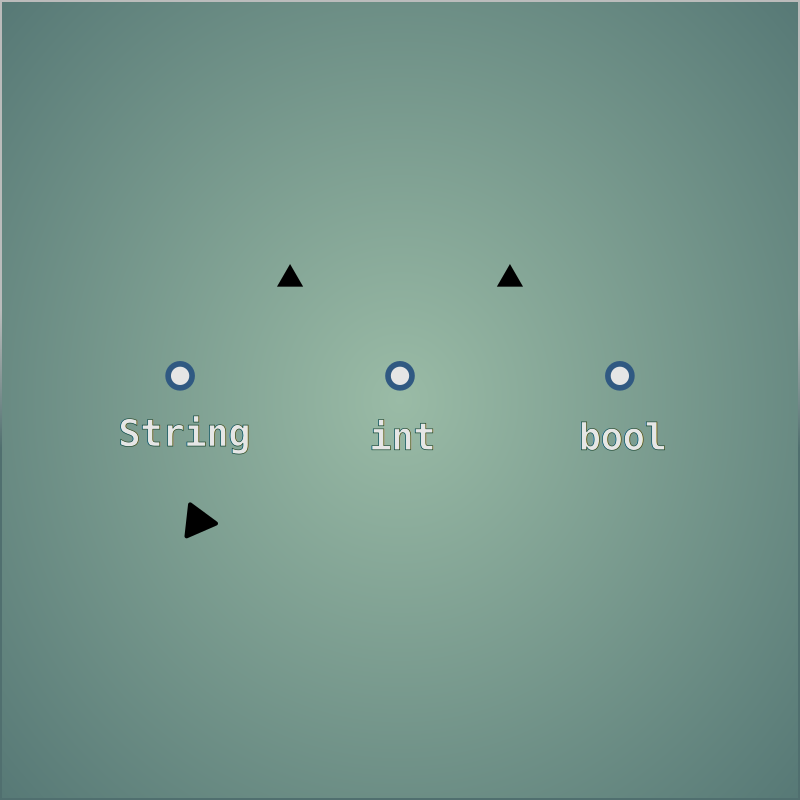
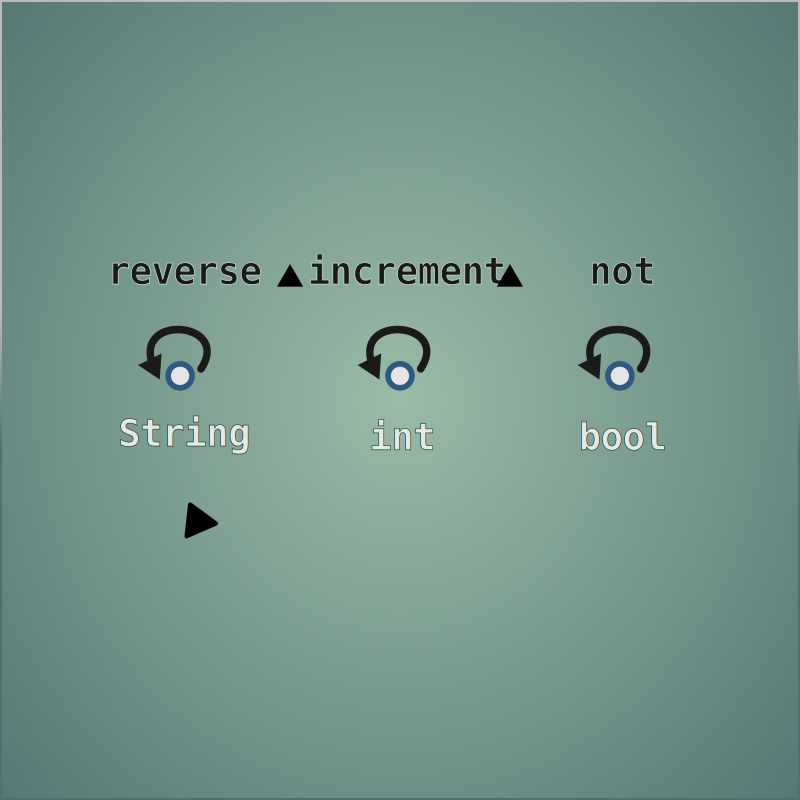
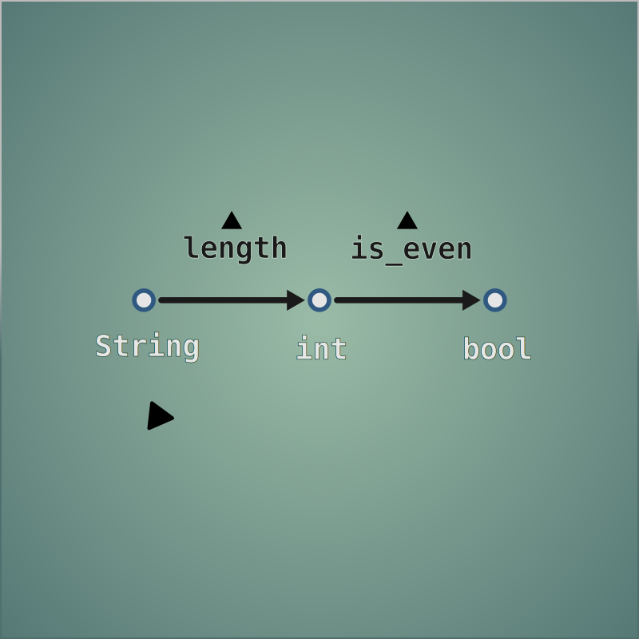
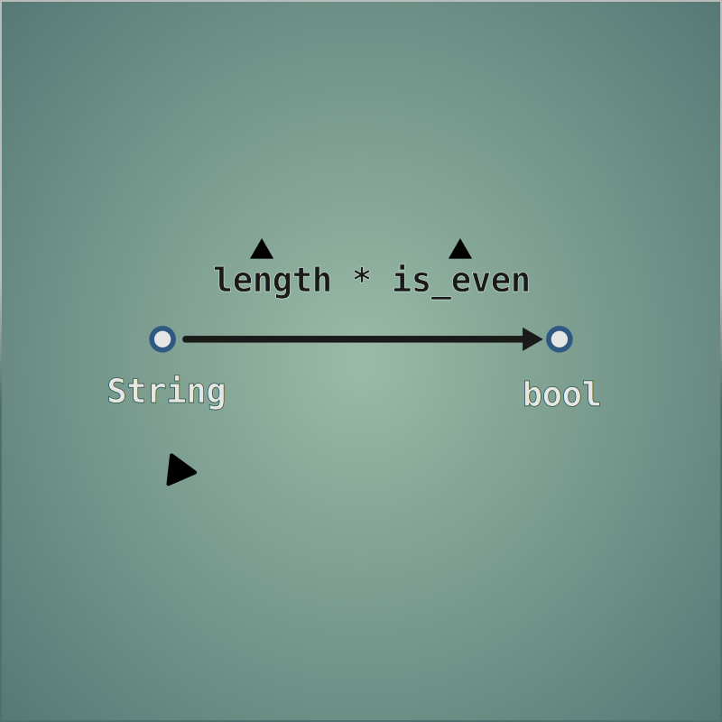
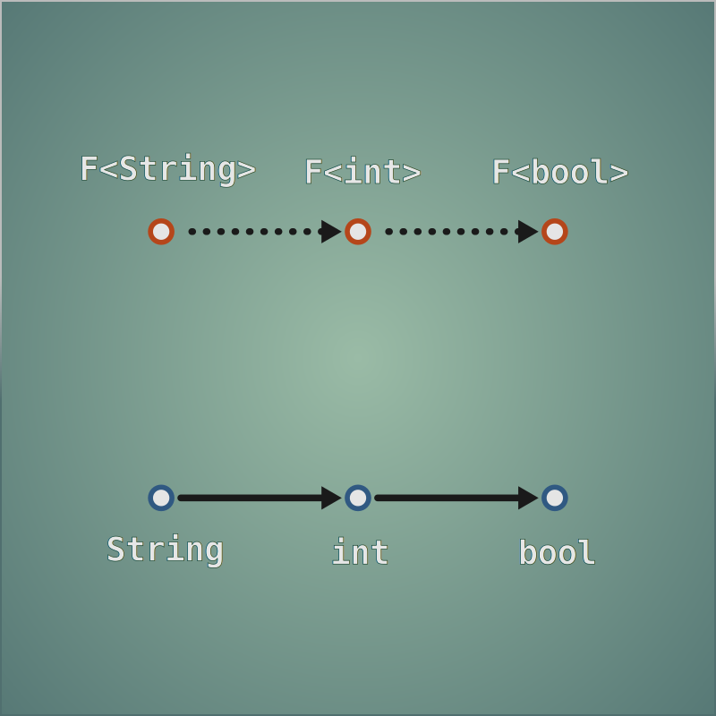
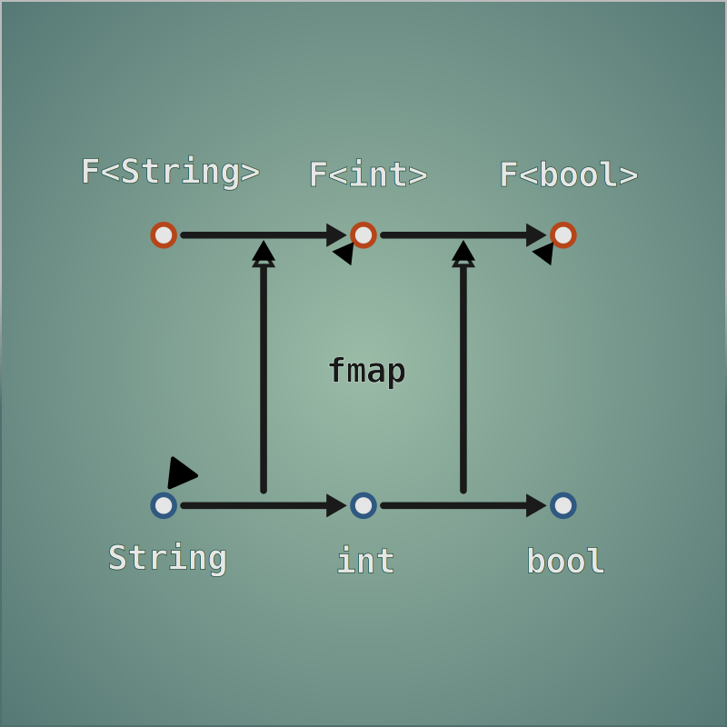
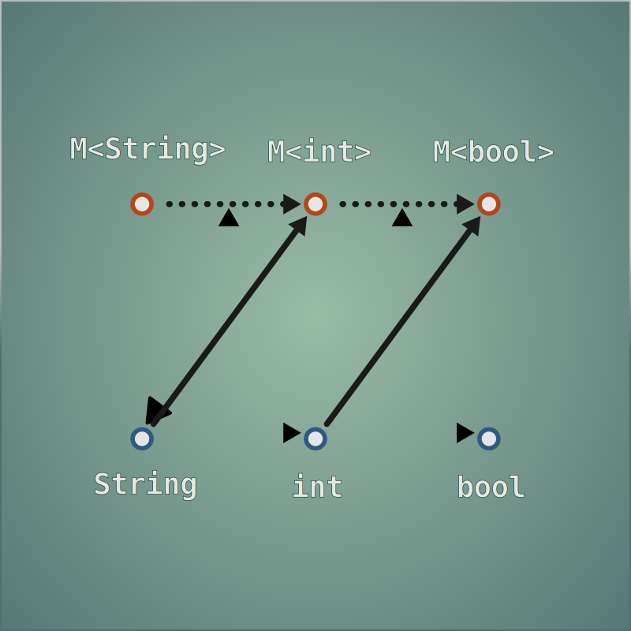
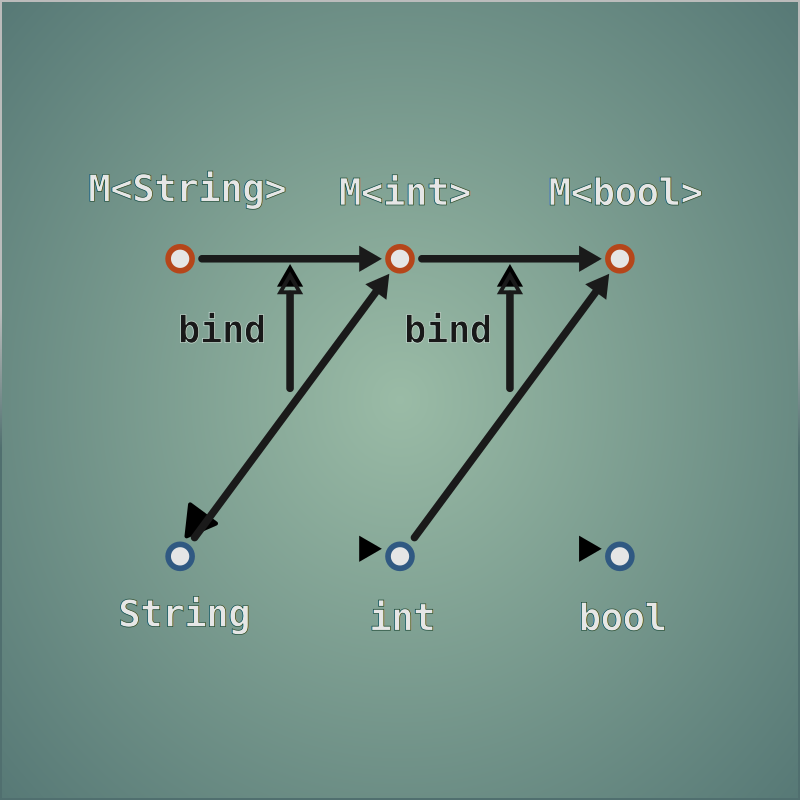

# Pipelanes
Lanes make your pipelines more functional. Compose functions that accept/return multiple values, retain results from prior pipeline stages, or succinctly operate on a subset of data.

This is an extension of std::ranges, not a replacement. It expands on the familiar combinators `transform` and `filter` and introduces some new utilities for managing lanes and nesting. [Operator overloading](#operators) is used for cleaner function composition.

> A recent compiler with C++23 support is required. If you're getting errors about range adaptor closures it means your compiler lacks library support for the latest std::ranges features (specifically "Pipe support for user-defined range adaptors")

Depends on [meta](github.com/Kyran-C/meta) and [common](github.com/Kyran-C/common)

Link or clone to `/external`

<br>

See the [tests](/tests/main.cpp) for more comprehensive examples.

If you're not already familiar with functor/monad composition, check out [Type categories and lifting functions](#type-categories-and-lifting-functions).


## Transform
The `transform_to...` combinators apply the function and either stores its result in a new lane at the front or back, or overwrites the specified lane. For functions that only operate on a subset of the data, use `from<...>` to specify the desired input lanes. `transform_nth` allows for in-place processing of lanes, and `transform_each` processes each lane in-place.

```cpp
views::iota()                                    //     0,           1,           2...
| transform_to_back( square )                    //    (0,  0),     (1, 1),      (2, 4)
| transform_to_front( from< 0, 1 >, sum )        // (0, 0,  0),  (2, 1, 1),  (6,  2, 4)
| transform_to< 1 >( from< 0, 2 >, product )     // (0, 0,  0),  (2, 2, 1),  (6, 24, 4)
| transform_nth< 0, 2 >( increment, decrement )  // (1, 0, -1),  (3, 2, 0),  (7, 24, 3)
| transform_each( is_even )                      // (F, T,  F),  (F, T, T),  (F,  T, F)
...
```

> The name `transform` is used instead of `map`, in order to maintain consistency with existing c++ ranges, and to avoid name clashes with `std::map`.


## Filter
Lensed filters allow filtering range elements based on individual lane values. Specify multiple lanes for an N-ary predicate. Use the any/all variants for filtering multiple lanes simultaneously.

```cpp
...
| filter_lens< 2 >( is_even )                  // check if the third lane is even
| filter_lens< 2, 3 >( std::greater )         // check if the third lane is greater than the fourth
| filter_lens_any< 0, 1 >( is_odd )           // check if either the first or second lanes are odd
| filter_lens_all< 1, 2 >( is_odd, is_even )  // check if the second lane is odd and the third lane is even
| filter_lens_all( is_positive )                // check if all lanes are positive
...
```


## Nesting
There are a few lane-management utilities:

`select< ... >` allows for rearranging, cloning, and eliminating lanes

`gather` to group lanes together

`flatten` to flatten nested lanes/tuple values

```cpp
// determine if two players are within audible range based on their xy coordinates
player_pairs()                                  // ({P1}, {P2}), ...
| transform_each( get_entity_pos )              // ((0, 1, 0), (3, 5, 7))
| flatten< 1 >()                                // ((0, 1, 0), 3, 5, 7)
| flatten()                                     // (0, 1, 0, 3, 5, 7)
| select_lanes< 0, 3, 1, 4 >()                  // (0, 3, 1, 5)
| gather_to_back< 0, 1 >()                      // (1, 5, (0, 3))
| gather_to_back< 0, 1 >()                      // ((0, 3), (1, 5))
| transform_each( distance )                    // (3, 4)
| transform_each( square )                      // (9, 16)
| transform_from< 0, 1 >( sum )                 // 25
| transform( sqrt )                             // 5
...
```

## Lensing
Lensing allows focusing on a subset of the values in the pipeline. This avoids having to continually specify which lanes you want to operate on.
`lens< n, m >(...)` will target lanes n and m. `unlens< n >(...)` targets all lanes except n. The pipeline you pass in will only see the specified lanes, and will have its results merged back into place in the main pipeline.
See [tests](/tests/main.cpp) for examples.

## Operators
Several operators are overloaded to perform different composition operations.
> Note that C++ operator precedence and associativity limit our options here. Certain choices must be made to avoid excess parentheses around sub-expressions.

`|` is already used by std::ranges, for composing combinators that act on ranges. 
```cpp
auto bars
   = get_bars()
   | transform( []( auto bar ){ return tuple{ bar, bar }; } )
   | transform_nth< 1u >( []( auto bar ){ return bar + 1; } );
```

<br>
<br>

When passing functions into combinators, sometimes we'd like to compose several functions together, without resorting to separate pipeline steps...

`*` is used for regular function composition, similar to `.` in other languages, except it works left to right. This is consistent with how `|` works. It has the highest precedence of any operator.
```cpp
auto chain = f1 * f2 * f3;
chain( 42 );

// equivalent to:

f3( f2( f1( 42 ) ) );
```

`>` is fmap. Currently supports tuples, optional, or any type that specializes `fmap< T >( t, func )`
```cpp
my_tuple > []( int a, int b ){ return a + b; };
my_optional > []( int a ){ return a > 0; };
```

`>=` is bind. Just like fmap, it supports tuples, optional, or any type that specializes `bind< T >( t, func )`
```cpp
my_tuple >= [&]( int x, int y ){ return rect_to_polar( x, y ); };  // rect_to_polar() returns tuple< int, int >
my_optional >= [&]( int a ){ return divide( 10, a ); };  // divide() returns maybe< int >
```

These 3 composition operators allow sequential function chaining without needing to manually combine them
```cpp
some_pipeline()
| transform( a >= b > c * d )
...
```
See [Type categories and lifting functions](#type-categories-and-lifting-functions) for more info.

<br>
<br>

`>>=` is (confusingly) not bind, but an extraction operator for ranges. Each element in the range is passed to the consuming function, which returns nothing. Precedence is lowest, so it works well at the end of an expression.
```cpp
get_bars()
  | transform( foo_func )
>>= []( auto fooed_bar )
    {
        std::println( fooed_bar.baz );
    };
```

<br>
<br>

`<` and `>` are for [user-defined combinators](#user-defined-combinators). Precedence is the same as bind and map, so no need for extra parens when composing in a chain of other operators.
```cpp
auto map_twice = ...;

get_bars()
<map_twice> foo_func // the bars get fooed twice
>>= print_bars;
```

## User-defined combinators
There's only a small number of operators to overload, and many possible ways to compose functions. To address this, `<` and `>` are used to create an infix operator which composes functions in a novel way. You can write a higher order binary function that performs the desired composition, and wrap it in `<...>` to treat it as an infix operator. The most convenient way is with a named lambda which takes the left and right functions as arguments, and returns back another function that takes the value types as arguments.


<br>
<br>

## Type categories and lifting functions

The following is a graphical explanation of functor and monad composition from first principles. 

### Types
Types are sets of values.



<br>
<br>

### Endo-Functions
Functions can map a type back to itself, by mapping each input value to an output value.



<br>
<br>

### Functions
Functions can also map values of different types. There are many ways to map between two types.



The input and output type can be the same, but for the sake of diagram clarity, we'll consider mappings between different types.

<br>
<br>

### Function Composition
We can combine two functions together if their input and output types match. This eliminates the need to store an intermediary value and perform multiple steps.



We use the `*` operator to denote function composition evaluated left-to-right (rather than the right-to-left evaluation of the `.` operator in other functional languages). This is extremely valuable because it allows us to build brand new functions which abstract away implementation details, without having to actually write a new implementation from scratch.

<br>
<br>

### Enriched Types
Now we introduce some new type categories. Functors and monads are not a particular type or template; they're closer to a concept in C++ terms. You can't have an instance of a `Functor` or `Monad` class, but a family of types can model these concepts if it satisfies the requirements. They describe types with **complications**, where some extra context is involved to access values.

An instance of the functor or monad pattern consists of a parameterized type, plus some functionality to help with composition. 'Parameterized type' meaning that instead of a simple type `T`, they represent some enriched type category: `list<T>`, `maybe<T>`, `future<T>`, etc. In our diagrams, we'll use `F` or `M` to mean any arbitrary functor or monad.

<br>
<br>

### Functors
There's a correspondence between the simple type `T`, and some functor type `F<T>`. However all the existing functions we have can only operate on simple types. 



Rewriting every function to also operate on our new enriched type will be a lot of tedious work. We know how to get the values in and out of the functor, but doing it by hand is a bit annoying; we'd like to be able to compose a bunch of functions together and smoothly navigate through our enriched category of types without having to stop at each step to unwrap and re-wrap the values.

<br>
<br>

### Fmap

Instead of reimplementing every function, we write an implementation of `fmap`. Its purpose is to lift a simple function into the functor category so it can be reused. These lifted functions can be composed together just like simple functions, meaning we can operate fluently on functor types without having to convert back and forth. 



Note that `fmap` is implemented differently for each functor type, since it encapsulates the boilerplate of getting values in and out of the functor. There's a few rules it should abide by, like for example `fmap( a * b )` should be the same as `fmap( a ) * fmap( b )`. It shouldn't matter whether you compose two functions and then lift them, or lift them individually and then compose.

<br>
<br>

### Monads

Monads are an extension of the functor pattern. They also provide functionality for composing 'monadic functions'. These functions are 'partially enriched'; their return types are monads, but they expect simple values as input. 



If we used `fmap`, it would lift both ends of the function, resulting in a doubly-nested return type. We'd still have diagonal arrows that can't be composed. 

<br>
<br>

### Bind

`bind` is similar to `fmap`, except it adapts the input of the function without double wrapping the output. Again, we're abstracting away the boilerplate of getting values from the monad, so we can write simple functions in isolation and then compose them together. 



Some implementations of `bind` just reuse `fmap` followed by a join operation (for example with lists, flattening nested lists into a single list)

Both of these lifting functions need to obey a few rules so that they behave as expected. Composing two simple functions and then lifting the result should be equivalent to lifting the two functions and then composing them. Basically they can't arbitrarily throw away values. It needs to preserve the values and structure/context of its input.


